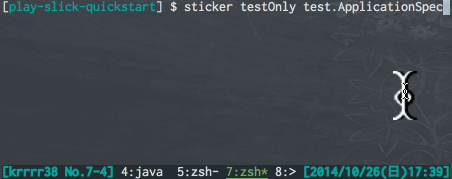

## sbt-sticker

Show a notification as a sticker while command running.

### About

This is a sbt plugin. While sbt command runnning, your notification is fixed like a sticker. When change the sticker, the command would be finished and it will be disappear soon automatically.



### Requirement

#### On Mac

Download [GrowlNotify](http://growl.info/downloads#generaldownloads).

#### Others

Not supported yet.

### Usage

- write following sbt-sticker plugin declaration into `project/plugins.sbt`(project seting) or `~/.sbt/0.13/plugins/build.sbt`(global setting).

```scala
resolvers += "Maven Repository on Github" at "http://krrrr38.github.io/maven/"

addSbtPlugin("com.krrrr38" % "sbt-sticker" % "0.0.2")
```

That's ALL!! Now, you can use `sticker` command in any projects. To show a sticker, just add `sticker` before basic commands in sbt console.

#### Disable Plugin
- If wanna disable plugin in some project...?
	- sbt-sticker uses `AutoPlugin` which is a new feature in sbt 0.13.5.
	- SEE [Enabling and disabling auto plugins](http://www.scala-sbt.org/0.13/tutorial/Using-Plugins.html#Enabling+and+disabling+auto+plugins)

In `build.sbt`, write following configuration, then the plugin would be disabled.

```scala
lazy val root = project.in( file(".") ).disablePlugins(StickerPlugin)
```

### Customize Images

sbt-sticker uses following images. (If not exist, sbt-sticker generate default files.)

- When command started
	- `~/.sbt/sticker/images/start.png`
- When command successed
	- `~/.sbt/sticker/images/success.png`
- When command failed
	- `~/.sbt/sticker/images/failure.png`

The default image file is from [http://www.scala-sbt.org/](http://www.scala-sbt.org/)
